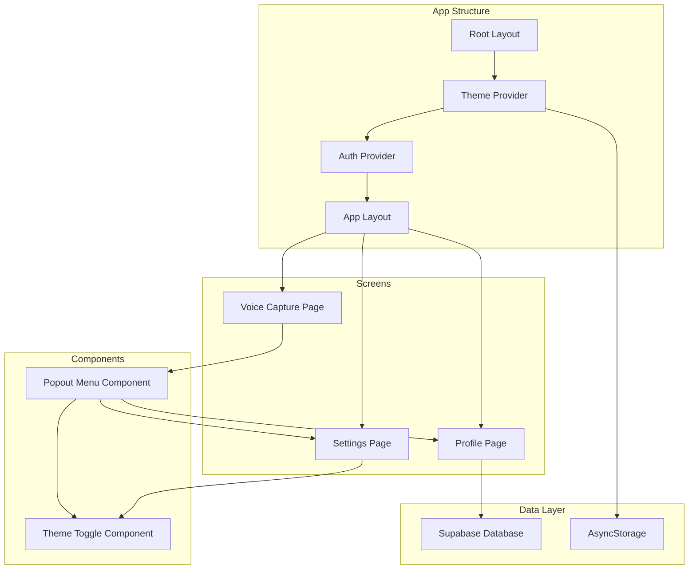

# Dark Mode & Profile Feature Implementation Plan

## Supabase Migration SQL
Copy and run this in Supabase SQL Editor:

```sql
-- ============================================================
-- User Profiles Table Migration
-- Run this in Supabase SQL Editor
-- ============================================================

-- Drop existing table if it exists (for re-running migration)
DROP TABLE IF EXISTS public.user_profiles CASCADE;

-- ============================================================
-- USER_PROFILES TABLE
-- Stores user profile information: Name, DOB, Profession, City, Bio
-- ============================================================
CREATE TABLE public.user_profiles (
  id UUID PRIMARY KEY DEFAULT gen_random_uuid(),
  user_id UUID NOT NULL REFERENCES auth.users(id) ON DELETE CASCADE,
  full_name TEXT,
  date_of_birth DATE,
  profession TEXT,
  city TEXT,
  bio TEXT,
  created_at TIMESTAMPTZ DEFAULT NOW(),
  updated_at TIMESTAMPTZ DEFAULT NOW()
);

-- Enable Row Level Security
ALTER TABLE public.user_profiles ENABLE ROW LEVEL SECURITY;

-- ============================================================
-- RLS POLICIES
-- ============================================================

-- Users can view their own profile
CREATE POLICY "Users can view own profile"
  ON public.user_profiles FOR SELECT
  USING (auth.uid() = user_id);

-- Users can insert their own profile
CREATE POLICY "Users can insert own profile"
  ON public.user_profiles FOR INSERT
  WITH CHECK (auth.uid() = user_id);

-- Users can update their own profile
CREATE POLICY "Users can update own profile"
  ON public.user_profiles FOR UPDATE
  USING (auth.uid() = user_id)
  WITH CHECK (auth.uid() = user_id);

-- ============================================================
-- INDEXES
-- ============================================================

-- Unique index on user_id (one profile per user)
CREATE UNIQUE INDEX idx_user_profiles_user_id ON public.user_profiles(user_id);

-- Index for created_at queries
CREATE INDEX idx_user_profiles_created_at ON public.user_profiles(created_at DESC);

-- ============================================================
-- TRIGGER for updated_at
-- ============================================================

-- Reuse existing trigger function if available, otherwise create it
CREATE OR REPLACE FUNCTION handle_updated_at()
RETURNS TRIGGER AS $$
BEGIN
  NEW.updated_at = NOW();
  RETURN NEW;
END;
$$ LANGUAGE plpgsql;

-- Create trigger for user_profiles
CREATE TRIGGER user_profiles_updated_at
  BEFORE UPDATE ON public.user_profiles
  FOR EACH ROW
  EXECUTE FUNCTION handle_updated_at();

-- ============================================================
-- HELPER FUNCTION: Get or create user profile
-- ============================================================

CREATE OR REPLACE FUNCTION get_or_create_user_profile(p_user_id UUID)
RETURNS public.user_profiles AS $$
DECLARE
  v_profile public.user_profiles;
BEGIN
  -- Try to get existing profile
  SELECT * INTO v_profile
  FROM public.user_profiles
  WHERE user_id = p_user_id;

  -- If not found, create a new one
  IF NOT FOUND THEN
    INSERT INTO public.user_profiles (user_id)
    VALUES (p_user_id)
    RETURNING * INTO v_profile;
  END IF;

  RETURN v_profile;
END;
$$ LANGUAGE plpgsql SECURITY DEFINER;
```


## Overview
This plan outlines the implementation of:
1. Dark mode toggle with persistent theme state
2. Profile page with user information (Name, DOB, Profession, City, Bio)
3. Gear icon popout menu on voice capture page with three options: Profile, Mode Toggle, Settings

## Architecture Overview



## Database Schema

### user_profiles Table
```sql
create table public.user_profiles (
  id uuid primary key default gen_random_uuid(),
  user_id uuid not null references auth.users(id) on delete cascade,
  full_name text,
  date_of_birth date,
  profession text,
  city text,
  bio text,
  created_at timestamptz default now(),
  updated_at timestamptz default now()
);

alter table public.user_profiles enable row level security;

create policy "Users can view own profile"
  on public.user_profiles for select
  using (auth.uid() = user_id);

create policy "Users can update own profile"
  on public.user_profiles for update
  using (auth.uid() = user_id)
  with check (auth.uid() = user_id);

create policy "Users can insert own profile"
  on public.user_profiles for insert
  with check (auth.uid() = user_id);

create unique index idx_user_profiles_user_id on public.user_profiles(user_id);
```

## Implementation Steps

### 1. Supabase Migration
- Create `supabase_migration_add_user_profiles.sql` with the schema above
- Run migration in Supabase SQL Editor

### 2. Theme Provider
Create `src/providers/ThemeProvider.tsx`:
- Use `useTheme` from Tamagui for theme switching
- Persist theme preference using AsyncStorage
- Provide `theme` and `toggleTheme` via context
- Default to 'light' theme

### 3. Update Root Layout
Modify `app/_layout.tsx`:
- Wrap existing providers with ThemeProvider
- Ensure ThemeProvider is inside TamaguiProvider

### 4. Type Definitions
Update `src/types/index.ts`:
- Add `UserProfile` type with fields: id, user_id, full_name, date_of_birth, profession, city, bio, created_at, updated_at

### 5. Profile API Hooks
Create `src/features/profile/api.ts`:
- `useProfile()` - Fetch user profile data
- `useUpdateProfile()` - Update profile data
- Handle profile creation if it doesn't exist

### 6. Profile Page
Create `app/(app)/profile.tsx`:
- Form with fields: Name, DOB (date picker), Profession, City, Bio (textarea)
- Use Tamagui components: YStack, XStack, Input, Button
- Save button to update profile
- Loading states and error handling

### 7. Update App Layout
Modify `app/(app)/_layout.tsx`:
- Add profile route with title "Profile"

### 8. Popout Menu Component
Create `src/components/ui/PopoutMenu.tsx`:
- Reusable menu component with backdrop
- Animated slide-in from bottom or fade-in
- Menu items with icons and labels
- Close on backdrop press or item selection
- Use Tamagui: YStack, XStack, View, Animated

### 9. Update Voice Capture Page
Modify `app/(app)/index.tsx`:
- Replace direct settings navigation with popout menu
- Add state for menu visibility
- Menu items:
  - Profile (navigate to profile page)
  - Mode Toggle (toggle theme)
  - Settings (navigate to settings page)

### 10. Theme Toggle Component
Create `src/components/ui/ThemeToggle.tsx`:
- Switch/toggle component using Tamagui
- Sun/Moon icons for visual feedback
- Use ThemeProvider context

### 11. Update Settings Page
Modify `app/(app)/settings.tsx`:
- Add theme toggle section at top
- Use ThemeToggle component
- Maintain existing task groups functionality

### 12. Tamagui Theme Consistency
Review and update all UI components to use Tamagui theme tokens:
- Replace hardcoded colors with `$color`, `$background`, `$primary`, etc.
- Update components:
  - Button.tsx
  - Input.tsx
  - Card.tsx
  - AppText.tsx
  - Heading.tsx
  - Screen.tsx
  - TaskCard.tsx
  - TodoItem.tsx
  - EditableChip.tsx

## Component Specifications

### PopoutMenu Component Props
```typescript
interface PopoutMenuProps {
  visible: boolean;
  onClose: () => void;
  items: MenuItem[];
}

interface MenuItem {
  icon: React.ReactNode;
  label: string;
  onPress: () => void;
}
```

### ThemeToggle Component
- Uses Tamagui Switch component
- Connected to ThemeProvider context
- Visual feedback with Sun/Moon icons

### Profile Page Fields
- Name: Text input (required)
- DOB: Date picker (optional)
- Profession: Text input (optional)
- City: Text input (optional)
- Bio: Textarea (optional, max 500 chars)

## Design Considerations

### Dark Mode
- Ensure all colors have proper contrast in both themes
- Test semantic colors (error, success, warning, info) in dark mode
- Update dark theme colors in `src/design-system/themes.ts` if needed

### User Experience
- Smooth theme transitions
- Profile auto-save or explicit save button
- Form validation for required fields
- Loading states during profile operations

### Performance
- Profile data caching with React Query
- Debounced profile updates
- Optimistic UI updates where appropriate

## Testing Checklist
- [ ] Dark mode toggle works and persists
- [ ] Profile page loads and displays data
- [ ] Profile form saves correctly
- [ ] Popout menu opens/closes smoothly
- [ ] All three menu options navigate correctly
- [ ] Theme applies consistently across all screens
- [ ] Date picker works for DOB field
- [ ] Error handling for profile operations
