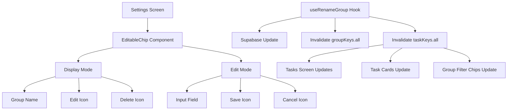

# Task Groups - Chip Style UI Implementation Plan

## Overview
Transform the task groups section in settings from card-based layout to inline chips with editable icons for full CRUD operations. Group name changes should automatically reflect everywhere (tasks screen, task cards).

## Current State Analysis

### Existing Components
- **settings.tsx**: Displays groups as cards with delete button only
- **groups/api.ts**: Has `useRenameGroup` hook but not used in UI
- **tasks.tsx**: Already uses chip-style for group filtering (good reference)
- **Tabs.tsx**: Similar chip-style component that can be adapted

### Current Issues
1. Groups appear as full-width cards (not space-efficient)
2. No edit functionality for group names
3. `useRenameGroup` exists but not connected to UI
4. Group name changes don't invalidate task queries (won't reflect in tasks)

## Proposed Solution

### Architecture Diagram



### Component Structure

#### 1. EditableChip Component (New)
**Location**: `src/components/ui/EditableChip.tsx`

**Props**:
```typescript
interface EditableChipProps {
    id: string;
    name: string;
    isEditing: boolean;
    onEdit: (id: string) => void;
    onSave: (id: string, newName: string) => void;
    onCancel: () => void;
    onDelete: (id: string, name: string) => void;
    isPending?: boolean;
}
```

**Features**:
- Display mode: Shows group name with edit/delete icons
- Edit mode: Shows input field with save/cancel icons
- Inline editing without modal
- Consistent styling with existing chip components

#### 2. Updated Settings Screen
**Location**: `app/(app)/settings.tsx`

**Changes**:
- Replace card-based group list with `XStack` of `EditableChip` components
- Add state for tracking which group is being edited
- Import and use `useRenameGroup` hook
- Handle edit/save/cancel/delete actions

#### 3. Updated useRenameGroup Hook
**Location**: `src/features/groups/api.ts`

**Changes**:
- Add `taskKeys.all` to invalidation in `onSuccess`
- This ensures tasks screen and task cards reflect group name changes

## Implementation Steps

### Step 1: Create EditableChip Component
- Create `src/components/ui/EditableChip.tsx`
- Implement display mode with edit/delete icons
- Implement edit mode with input and save/cancel icons
- Use consistent styling from `tokens.ts`
- Reference `Tabs.tsx` and tasks.tsx chip styles

### Step 2: Update Settings Screen Layout
- Replace card-based group list (lines 64-89)
- Use `XStack` with `flexWrap="wrap"` for chip layout
- Map groups to `EditableChip` components
- Add state: `editingGroupId: string | null`

### Step 3: Add Edit Functionality
- Import `useRenameGroup` hook
- Add `handleEditGroup` function to set editing state
- Add `handleSaveGroup` function to call rename mutation
- Add `handleCancelEdit` function to clear editing state

### Step 4: Update useRenameGroup Hook
- Modify `onSuccess` callback in `src/features/groups/api.ts`
- Add: `queryClient.invalidateQueries({ queryKey: taskKeys.all })`
- This ensures all task-related UI updates automatically

### Step 5: Connect Delete Functionality
- Reuse existing `handleDeleteGroup` function
- Pass to `EditableChip` via `onDelete` prop
- Keep existing confirmation alert

### Step 6: Style Consistency
- Match chip styling to tasks.tsx group filter chips
- Use same colors, border radius, padding
- Ensure proper spacing between chips
- Handle empty states gracefully

## Visual Design Reference

### Current (Card Style)
```
┌─────────────────────────────────┐
│ ● Group Name              [🗑️]  │
└─────────────────────────────────┘
┌─────────────────────────────────┐
│ ● Another Group           [🗑️]  │
└─────────────────────────────────┘
```

### Proposed (Chip Style)
```
[Group Name ✏️ 🗑️] [Another Group ✏️ 🗑️] [Third Group ✏️ 🗑️]
```

### Edit Mode
```
[Group Name ✏️ 🗑️] [Another Group ✏️ 🗑️] [___________ ✅ ❌]
```

## Data Flow

### Rename Operation
1. User clicks edit icon on chip
2. Chip enters edit mode (input field appears)
3. User modifies name and clicks save
4. `useRenameGroup` mutation executes
5. Supabase updates `task_groups` table
6. Query invalidation triggers:
   - `groupKeys.all` → Settings screen updates
   - `taskKeys.all` → Tasks screen updates
7. All UI reflects new group name automatically

### Delete Operation
1. User clicks delete icon on chip
2. Confirmation alert appears
3. User confirms deletion
4. `useDeleteGroup` mutation executes
5. Supabase deletes from `task_groups` table
6. Tasks with this group_id become ungrouped (null)
7. Query invalidation updates all screens

## Technical Considerations

### State Management
- Use local state for edit mode (editingGroupId)
- Use React Query for data fetching and mutations
- Leverage automatic cache invalidation

### Performance
- Minimal re-renders due to targeted state
- Query invalidation ensures consistency
- No manual prop drilling needed

### Accessibility
- Proper touch targets for icons
- Clear visual feedback for edit mode
- Keyboard support for input field

### Edge Cases
- Empty group name validation
- Duplicate group names (optional)
- Concurrent edits (last write wins)
- Network error handling

## Files to Modify

1. **New**: `src/components/ui/EditableChip.tsx`
2. **Modify**: `app/(app)/settings.tsx`
3. **Modify**: `src/features/groups/api.ts`

## Testing Checklist

- [ ] Create new group appears as chip
- [ ] Edit icon appears on hover/tap
- [ ] Clicking edit switches to input mode
- [ ] Saving updates group name everywhere
- [ ] Canceling edit reverts to original name
- [ ] Delete icon shows confirmation
- [ ] Deleting removes chip and ungroups tasks
- [ ] Group name changes reflect in tasks screen
- [ ] Group name changes reflect in task cards
- [ ] Empty name validation works
- [ ] Loading states display correctly
- [ ] Error handling works properly
